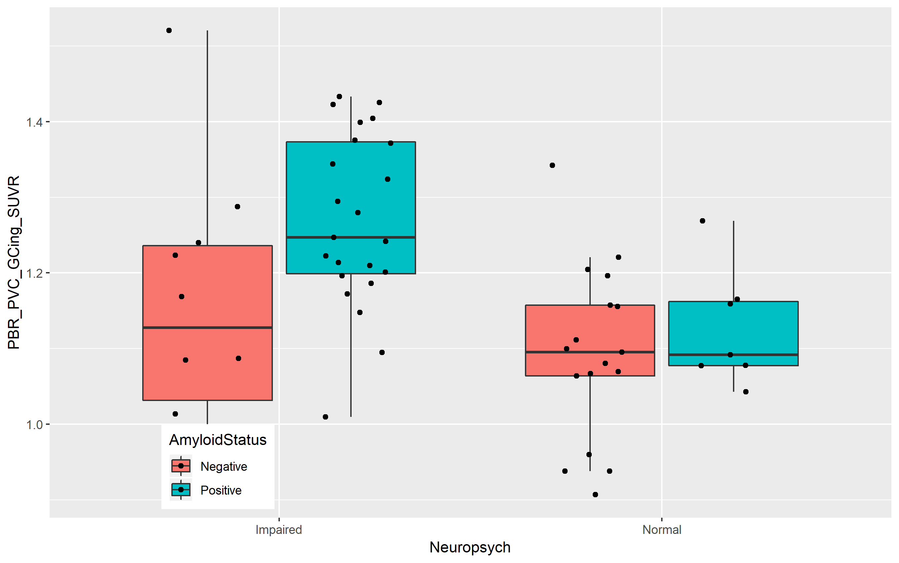

### I have a webpage!

And I can put all kinds of stuff on it!

I can add additional text.

I "could" write some code but i'm not going to haha

### ADD some links

You can also [check the internet](https://www.google.com/)\
I can link directly to my [about page](about.html)

Take a look at the plot:

Like this class!